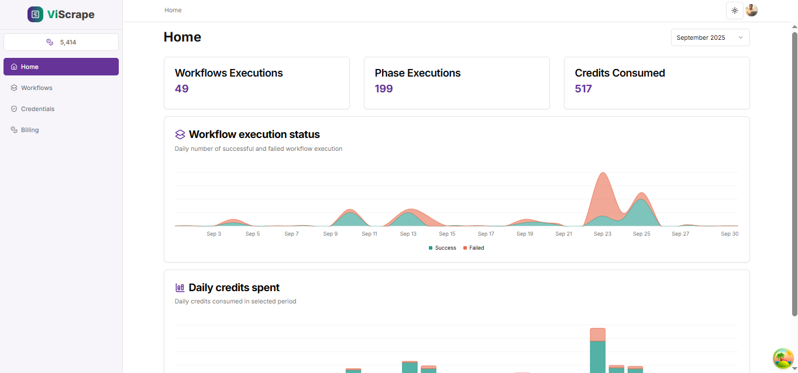
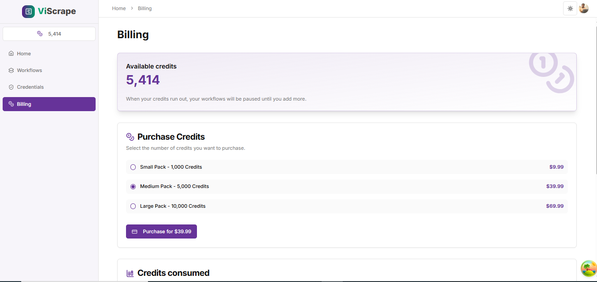
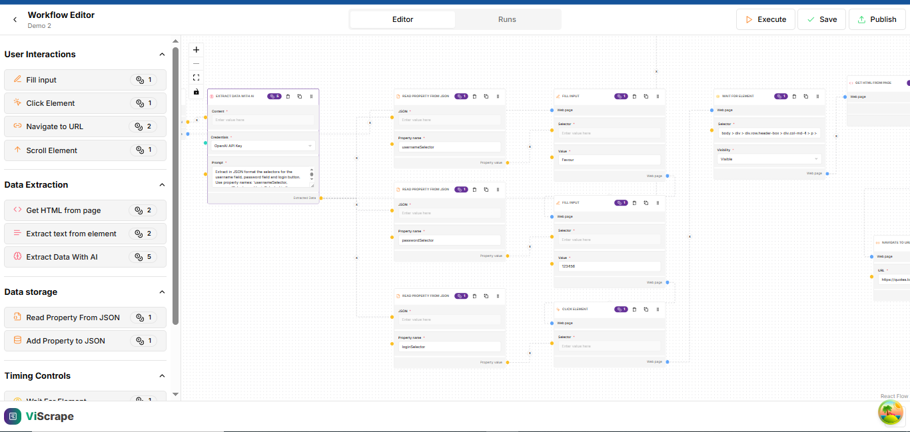

# ViScrape 
**AI-powered Visual Web Scraper**

ViScrape is an **interactive, drag-and-drop web scraping platform** that allows users to visually design, validate, and execute scraping workflows.  
It combines **traditional scraping tasks** with **AI-powered extraction**, user-friendly workflow management, and robust execution tracking.




---

## 🌟 Features  

Here are some of the most impressive features:  

1. **Visual Workflow Builder** – Create scraping pipelines with drag-and-drop nodes, edges, and live validation.  
2. **Rich Task Library** – Includes tasks like *Extract Text*, *Click Element*, *Wait for Element*, *Fill Input*, *Navigate to URL*, *Scroll to Element*, *Deliver via Webhook*, and more.  
3. **Anti-Bot & Protection Bypass** – Handles scraping protections to ensure workflows succeed in real-world sites.  
4. **Workflow Validation & Execution Engine** – Validates workflows, manages execution environments, and consumes credits per run.  
5. **Execution Viewer & Logs** – Observe executions step by step, collect logs, and browse execution history.  
6. **Publishing & Scheduling** – Publish/unpublish workflows, schedule them for later execution, and duplicate workflows with one click.  
7. **Credentials & User Management** – Built-in auth, credentials storage, and user account system.  
8. **Billing Integration** – User balance tracking and Stripe integration for billing and credit purchases.  
9. **AI-Powered Extraction** – Extract and interpret complex or semi-structured content using AI.  
10. **JSON Manipulation Tasks** – Read, modify, and extend JSON objects within workflows for flexible post-processing.  

---

## 🛠️ Tech Stack  

- **Frontend**: Nextjs 14, React (with drag-and-drop workflow UI) 
- **Database**: PostgreSQL  
- **Authentication**: JWT / Auth system  
- **Billing**: Stripe API  
- **AI**: Integrated AI task for smart extraction  

---

## 🚀 Getting Started  

### Prerequisites  
- Node.js (v18+)  
- PostgreSQL  
- Stripe API keys
- BrightData Proxies

### Installation  

```bash
# Clone the repository
git clone https://github.com/Hoseafavour123/ViScrape.git

# Navigate into the project
cd ViScrape

# Install dependencies
npm install

# Set up environment variables
cp .env.example .env

# Run database migrations (example if using Prisma)
npx prisma migrate dev

# Start development server
npm run dev
```

---

## 📖 Usage  

1. **Sign up / Login** – Create a user account.  
2. **Create a Workflow** – Drag-and-drop tasks to build a scraper.  
3. **Validate & Execute** – Run the workflow in a controlled environment.  
4. **View Results** – Inspect logs, outputs, and data in the execution viewer.  
5. **Publish / Schedule** – Share your workflow or schedule it to run automatically.  
6. **Manage Billing** – Purchase credits via Stripe and track balance usage.  

---

## 🧩 Example Tasks  

- **Extract Text from Element** – Scrape textual content.  
- **Click Element** – Simulate clicks.  
- **Fill Input** – Automate form filling.  
- **Wait for Element** – Handle async content.  
- **Deliver via Webhook** – Push scraped data to external systems.  
- **AI Extraction** – Use AI to interpret data.  
- **JSON Manipulation** – Add/Read properties from JSON.  
---

## 🤝 Contributing  

Contributions are welcome! Please fork the repo and open a PR.  

---

## 📜 License  

This project is licensed under the MIT License.  

---

## 👨‍💻 Author  

**Favour Tonzai Hosea**  
GitHub: [@Hoseafavour123](https://github.com/Hoseafavour123)  

